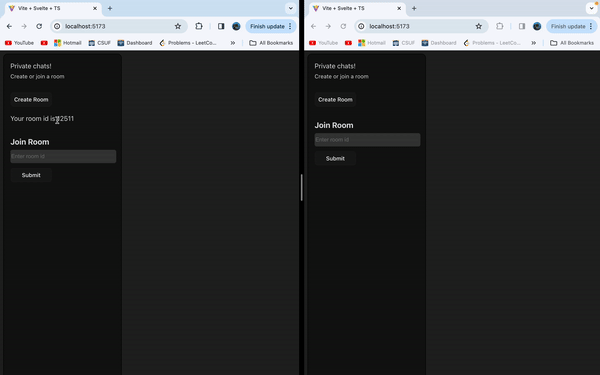

<h1 align="center">Chat Rooms 💬 </h1>

  
    

> Create a private chat room that allows others to join! Built with FastAPI and Svelte

## ✨ Demo

## Install

#### Create and activate virtual environment

`python -m venv venv`

`source venv/bin/activate`

### Install dependencies

`pip install -r requirements.txt`

### To Run

`uvicorn main:app --reload`

open up a new terminal

`cd frontend`

`npm install`

`npm run dev`
